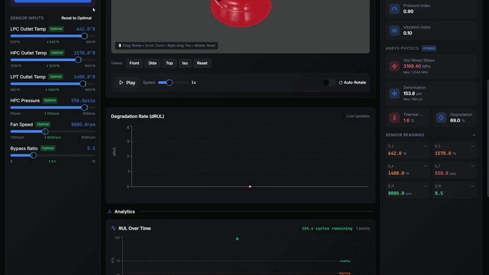

# Physics-Informed Hybrid Digital Twin for Aircraft Engine RUL Prediction

>Physics-Informed Hybrid CNN-BiLSTM — **MAE: 5.70 cycles | RMSE: 6.27 cycles** on NASA N-CMAPSS DS02

A real-time digital twin that predicts the **Remaining Useful Life (RUL)** of aircraft turbofan engines by fusing a physics-informed CNN-BiLSTM neural network with ANSYS finite-element analysis constraints and a live 3D Blender visualizer.

---

## Live Demo — Blender 3D Visualizer



---

## Architecture

```
┌─────────────────────────────────────────────────────────────────────┐
│                        DATA PIPELINE                                │
│                                                                     │
│  NASA N-CMAPSS DS02  ──►  14 Physical Sensors (X_s)               │
│  (6.5M rows, 9 engines)    3 Operating Conditions (W)              │
│                             ↓                                       │
│              ANSYS FEA Results (offline)                            │
│         ┌──────────────────────────────────┐                        │
│         │  Combustion Chamber Temp: 627°C  │                        │
│         │  Nozzle Temp:             475°C  │                        │
│         │  Von Mises Stress:    54–3544 MPa│                        │
│         │  Deformation:        0–0.189 mm  │                        │
│         └──────────────────────────────────┘                        │
│                             ↓                                       │
│         Physics Feature Engineering (6 features added):             │
│         thermal_ratio · thermal_margin · nozzle_thermal_ratio       │
│         stress_intensity · deformation_index · fatigue_damage       │
└─────────────────────────────────────────────────────────────────────┘
                             ↓
┌─────────────────────────────────────────────────────────────────────┐
│                     HYBRID MODEL (CNN-BiLSTM)                       │
│                                                                     │
│  Input: sequence of 30 time steps × (sensor + physics) features    │
│                                                                     │
│  ┌────────────────────┐      ┌─────────────────────────┐           │
│  │   CNN Branch       │      │   BiLSTM Branch          │           │
│  │  Conv1D(64) × 2    │      │  BiLSTM(64, return_seq) │           │
│  │  MaxPool → Drop    │      │  BiLSTM(32)              │           │
│  │  Conv1D(128)       │      │  Dropout(0.2)            │           │
│  │  GlobalAvgPool     │      └────────────┬────────────┘           │
│  └──────────┬─────────┘                   │                         │
│             └──────────────┬──────────────┘                         │
│                            ↓                                        │
│                     Concatenate → Dense(128) → Dense(64)            │
│                            ↓                                        │
│             ┌──────────────┴──────────────┐                         │
│             │  RUL output (linear)        │  dRUL output (tanh)    │
│             └─────────────────────────────┘                         │
└─────────────────────────────────────────────────────────────────────┘
                             ↓
┌─────────────────────────────────────────────────────────────────────┐
│                    REAL-TIME DIGITAL TWIN                           │
│                                                                     │
│  React Dashboard  ◄──WebSocket──►  FastAPI Backend                 │
│  (sensor sliders,                  (HybridMLPredictor,              │
│   RUL graph,                        RealisticEngineSimulator)       │
│   status alerts)                    ↕ TCP socket                   │
│                                   Blender Server (bpy)              │
│                                   (3D render → JPEG stream)         │
└─────────────────────────────────────────────────────────────────────┘
```

**Signal flow:**
1. User adjusts sensor sliders on the React dashboard (or selects a real engine from the dataset)
2. FastAPI backend runs physics feature engineering + CNN-BiLSTM inference
3. Blender receives `Temperature / Pressure / RUL / vibration_intensity` over TCP, updates material shaders and mesh deformation, renders a JPEG frame
4. Frame streams back through the WebSocket to the dashboard at < 50 ms end-to-end

---

## Model Performance

Trained on **NASA N-CMAPSS DS02** (see [Dataset](#dataset) section below).  
Evaluation on the held-out test split; RUL clipped at 125 cycles.

| Model | RMSE (cycles) | MAE (cycles) | Epochs |
|---|---|---|---|
| Baseline CNN-BiLSTM | 7.31 | 6.14 | 9 |
| **Physics-Informed Hybrid** | **6.27** | **5.70** | **11** |

**Improvement from physics features: −1.04 RMSE cycles (−14.2%)**

Physics features encode ANSYS-derived thermal, stress, and deformation limits directly into the model's feature space — making the network "aware" of what sensor readings actually mean for material health, not just statistical patterns.

---

## Dataset

**NASA N-CMAPSS (New Commercial Modular Aero-Propulsion System Simulation) — DS02-006**

| Property | Value |
|---|---|
| Source | [NASA PCoE Prognostics Data Repository](https://www.nasa.gov/intelligent-systems-division/discovery-and-systems-health/pcoe/pcoe-data-set-repository/) |
| Engines | 9 turbofan engines (dev + test splits) |
| Raw rows | ~6.5 million time steps |
| Sensors | 14 physical (`X_s`) + 14 virtual (`X_v`) per step |
| Operating conditions | 3 continuous variables (`W`) |
| RUL label | Continuous, cycle-accurate, clipped at 125 |
| File used | `N-CMAPSS_DS02-006.h5` (not included — see note below) |

The older **C-MAPSS FD001–FD004** files (in `data/`) were used in early experiments; the final trained model runs on N-CMAPSS which provides continuous RUL labels and more realistic multi-condition operation.

> **Note:** The N-CMAPSS `.h5` file (~4 GB) is not checked in. Download it from the NASA repository linked above and place it at `nmapss/N-CMAPSS_DS02-006.h5` before training.

The C-MAPSS FD004 test set (in `data/`) is used by the backend server at runtime to demonstrate real engine playback without requiring the full N-CMAPSS file.

---

## ANSYS Integration

Two aerospace components were modelled in ANSYS Mechanical:

| Component | Analysis | Key Result |
|---|---|---|
| Combustion chamber (`combustion chamber.stl`) | Steady-state thermal + structural | Wall temp 626–627°C; stress 54–3544 MPa |
| Nozzle (`nozzle.stl`) | Thermal | Outlet temp 474–475°C |

These bounds are baked into `ANSYS_PHYSICS` constants in `hybrid_model_local.py` and `backend_server.py`. During training, raw sensor readings are mapped onto normalised thermal margin, stress intensity, and deformation index features — giving the model physically meaningful degradation signals instead of raw engineering units.

Raw ANSYS export files: `deformation.txt`, `stress.txt`, `temp_combustionchamber.txt`, `temp_nozzle.txt`.

---

## Repository Structure

```
RUL-prediction-for-aircraft-subsystems/
│
├── hybrid_model_local.py        # Training script — CNN-BiLSTM + physics features
├── backend_server.py            # FastAPI server + engine simulator + ML inference
├── blender_server.py            # Blender Python script — 3D render server
├── requirements.txt             # Python dependencies
├── run.txt                      # Quick-start commands
│
├── data/                        # NASA C-MAPSS FD001–FD004 (train/test/RUL)
├── model_artifacts/             # Trained Keras models, scalers, feature lists
│   ├── hybrid_model.keras       # Best model (physics-informed)
│   ├── baseline_model.keras     # Baseline (no physics features)
│   ├── hybrid_metrics.json      # RMSE / MAE scores
│   └── ansys_physics.json       # ANSYS-derived physical constants
│
├── jet-stream-dashboard/        # React frontend (Vite + Tailwind + Recharts)
│   └── src/components/dashboard/
│       ├── RULgraph.tsx         # Live RUL time-series chart
│       ├── SensorSlider.tsx     # Adjustable sensor inputs
│       ├── StreamViewer.tsx     # Blender JPEG stream display
│       └── PredictionPanel.tsx  # Status + physics metrics
│
├── Rocket_DigitalTwin_FINAL.blend  # Blender scene file
├── combustion chamber.stl          # ANSYS geometry — combustion chamber
├── nozzle.stl                      # ANSYS geometry — nozzle
└── docs/
    └── demo.gif                    # ← ADD YOUR RECORDING HERE
```

---

## Quick Start

### Prerequisites
- Python 3.8+
- Node.js 18+
- Blender 3.6+

### 1. Clone & install Python deps

```bash
git clone https://github.com/YOUR_USERNAME/RUL-prediction-for-aircraft-subsystems.git
cd RUL-prediction-for-aircraft-subsystems

python -m venv venv
# Windows:
venv\Scripts\activate
# macOS/Linux:
source venv/bin/activate

pip install -r requirements.txt
```

### 2. Install frontend deps

```bash
cd jet-stream-dashboard
npm install
```

### 3. Run the three services (separate terminals)

**Terminal 1 — Backend**
```bash
python backend_server.py
# → http://localhost:8000
```

**Terminal 2 — Blender 3D server**
```bash
# Replace X.x with your Blender version, PROJECT_DIR with your path
& "C:\Program Files\Blender Foundation\Blender X.x\blender.exe" \
  --background "PROJECT_DIR\Rocket_DigitalTwin_FINAL.blend" \
  --python "PROJECT_DIR\blender_server.py"
```
Or open the `.blend` file manually, go to the **Scripting** workspace, open `blender_server.py`, and click **Run Script**.

**Terminal 3 — Frontend**
```bash
cd jet-stream-dashboard
npm run dev
# → http://localhost:5173
```

### 4. (Optional) Retrain the model

Download `N-CMAPSS_DS02-006.h5` from NASA, place it in `nmapss/`, then:

```bash
python hybrid_model_local.py
# Trains baseline + hybrid models; saves to model_artifacts/
# ~40 min on CPU (24 GB RAM) with default subsampling (1/10)
```

---

## Tech Stack

| Layer | Technology |
|---|---|
| ML framework | TensorFlow / Keras |
| Physics FEA | ANSYS Mechanical |
| Backend API | FastAPI, Uvicorn, WebSockets |
| 3D visualizer | Blender 3.6+, `bpy` Python API |
| Frontend | React, Vite, Tailwind CSS, Recharts |
| Data | NumPy, Pandas, scikit-learn, h5py |

---

## License

GPL